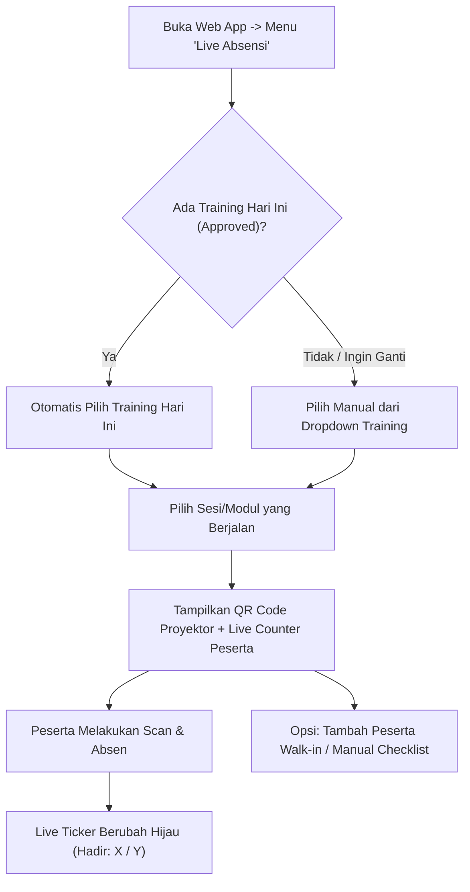
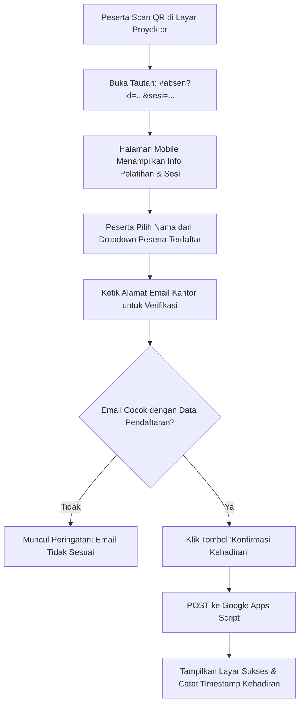

# Spesifikasi Desain: Sistem Absensi QR Pelatihan Terintegrasi (Live QR Attendance Hub)

- **Tanggal Dokumen**: 2026-10-09
- **Status**: Disetujui (Draft Final untuk Implementasi)
- **Target Platform**: Vanilla HTML5, CSS3, ES6 JavaScript, Google Apps Script, Google Sheets

---

## 1. 📌 Latar Belakang & Tujuan (Background & Intent)

### 1.1 Masalah Saat Ini
Sistem formulir pelatihan saat ini telah mencatat pengajuan training, approval workflow, jadwal sesi modul, dan daftar peserta lengkap dengan email di Google Sheets. Namun pada hari pelaksanaan (hari-H), pencatatan kehadiran masih manual (kertas absen fisik) atau terpisah dari sistem. Hal ini memperlambat proses verifikasi pasca-pelatihan (*Post-Training Trampoline*) dan penerbitan sertifikat.

### 1.2 Tujuan Sistem
Membangun **Sistem Absensi QR Pelatihan Terintegrasi (Live QR Attendance Hub)** yang:
1. **Otomatis Mengenali Pelatihan Hari Ini**: Trainer cukup membuka web app di layar proyektor laptop, sistem langsung mendeteksi pelatihan berstatus *Approved* yang jadwalnya jatuh pada hari ini.
2. **Menampilkan QR Code Interaktif Sesi**: Menampilkan QR Code beresolusi tinggi di layar proyektor untuk dipindai oleh peserta dengan kamera smartphone bawaan.
3. **Validasi Anti-Joki Tanpa Login Rumit**: Peserta memilih nama mereka dari daftar peserta terdaftar dan mengetikkan email untuk verifikasi kecocokan.
4. **Pencatatan Realtime & Terintegrasi**: Data kehadiran tersimpan otomatis ke tab Google Sheets baru (`Training Attendance`) dan terhubung langsung ke tab *Post Training Trampoline*.

---

## 2. 👥 Alur Pengguna (User Flows)

### 2.1 Alur Trainer / PIC (Layar Proyektor / Laptop)


1. Trainer membuka menu **"Live Absensi"** di sidebar.
2. Sistem otomatis membaca submission berstatus *Approved*. Jika tanggal modul/training cocok dengan hari ini, training otomatis terpilih. Trainer juga dapat memilih sesi modul yang spesifik (misal *Sesi 1: Fundamental*).
3. Trainer dapat mengaktifkan **Mode Layar Penuh (Projector Mode)** untuk menyembunyikan sidebar dan memaksimalkan keterbacaan QR Code.
4. Layar menampilkan:
   - Judul Pelatihan, Nama Trainer, Waktu & Modul Sesi.
   - QR Code tajam di sisi kiri/tengah.
   - Live Attendance Counter (*"18 / 20 Hadir - 90%"*) dan daftar peserta di sisi kanan.
   - Tombol *Manual Check-in* untuk peserta yang HP-nya bermasalah.
   - Tombol *+ Tambah Peserta Walk-in* jika ada peserta dadakan.

### 2.2 Alur Peserta Pelatihan (Smartphone)


1. Peserta mengarahkan kamera HP bawaan ke layar proyektor.
2. HP membuka halaman check-in web (`#absen?id=TRN-...&sesi=...`).
3. Peserta memilih namanya dari daftar dropdown.
4. Peserta memasukkan email kantor.
5. Sistem memvalidasi kesesuaian nama dan email secara instan di klien.
6. Klik **"Konfirmasi Kehadiran"**.
7. Data terkirim ke Google Apps Script dan browser peserta menampilkan status sukses *"Kehadiran Berhasil Dicatat"*. Halaman terkunci dari double submit.

---

## 3. 🗄️ Skema Data & Arsitektur Backend (Google Apps Script)

### 3.1 Tab Google Sheets: `"Training Attendance"`
Sistem membuat tab baru secara otomatis jika belum ada dengan struktur kolom berikut:

| No | Nama Kolom | Tipe Data | Contoh Nilai |
|:---|:---|:---|:---|
| 1 | `Waktu Absen` | String (Timestamp) | `2026-10-09 09:15:22 WIB` |
| 2 | `ID Training` | String | `TRN-20261004-FIN-SS` |
| 3 | `Nama Training` | String | `Workshop Golang Backend` |
| 4 | `ID Sesi Modul` | String | `Sesi 1: Fundamental Golang` |
| 5 | `Tanggal Sesi` | String (YYYY-MM-DD) | `2026-10-09` |
| 6 | `Nama Peserta` | String | `Budi Santoso` |
| 7 | `Email Peserta` | String | `budi.santoso@cpssoft.com` |
| 8 | `Departemen / Divisi` | String | `WEB DEVELOPER` |
| 9 | `Metode Absen` | String | `QR Web (Self)` atau `Manual by Trainer` |
| 10 | `Status Kehadiran` | String | `Hadir` |
| 11 | `Catatan / Keterangan` | String | `Peserta Terdaftar` atau `Peserta Walk-in` |

### 3.2 Endpoint Baru di `google-apps-script.js`

#### A. `doPost` Handlers
1. **`action: "recordAttendance"`**:
   - **Payload**:
     ```json
     {
       "action": "recordAttendance",
       "trainingId": "TRN-20261004-FIN-SS",
       "trainingTitle": "Workshop Golang Backend",
       "moduleId": "Sesi 1",
       "sessionDate": "2026-10-09",
       "participantName": "Budi Santoso",
       "participantEmail": "budi.santoso@cpssoft.com",
       "department": "WEB DEVELOPER",
       "method": "QR Web (Self)",
       "note": "Peserta Terdaftar"
     }
     ```
   - **Logika Server**:
     - Buka sheet `Training Attendance`.
     - Validasi duplikasi: Cek apakah kombinasi `(trainingId + moduleId + participantEmail)` sudah ada di sheet.
     - Jika sudah ada: Return `{ status: "exists", message: "Peserta sudah tercatat hadir pada sesi ini." }`.
     - Jika belum ada: Tambah baris baru ke sheet, return `{ status: "success", message: "Presensi berhasil dicatat." }`.

2. **`action: "manualAttendance"`**:
   - Sama dengan `recordAttendance` namun dengan flag `method: "Manual by Trainer"`.

#### B. `doGet` Handlers
1. **`action: "getAttendanceLogs"`**:
   - Parameter URL: `?action=getAttendanceLogs&trainingId=TRN-...` (opsional `&moduleId=...`).
   - Mengembalikan array log kehadiran JSON untuk training terkait:
     ```json
     [
       {
         "timestamp": "2026-10-09 09:15:22 WIB",
         "trainingId": "TRN-20261004-FIN-SS",
         "moduleId": "Sesi 1",
         "name": "Budi Santoso",
         "email": "budi.santoso@cpssoft.com",
         "status": "Hadir"
       }
     ]
     ```

---

## 4. 💻 Komponen & Implementasi Antarmuka (Frontend)

Sesuai arsitektur modular proyek (`src/` -> `scripts/build.js` -> `index.html` & `training_internal_plan.html`), komponen antarmuka dibagi menjadi:

### 4.1 Halaman Modular: `src/pages/absensi.html`
Terdiri dari dua sub-tampilan (*views*):

#### A. View 1: Trainer Hub & Projector Mode (`#page-absensi`)
* **Toolbar Sesi**:
  * Dropdown Pemilihan Training Aktif (dengan badge tanggal).
  * Dropdown Sesi Modul.
  * Tombol *Fullscreen Proyektor* (ikon SVG expand).
* **Grid 2 Kolom (Desktop / Proyektor)**:
  * **Kolom Kiri (QR Showcase)**:
    * Frame kartu berdesain elegan (*Earthy Theme*).
    * Canvas/SVG QR Code besar (260x260px atau lebih besar pada layar proyektor).
    * Link alternatif pendek dan tombol *Salin Link Absen*.
  * **Kolom Kanan (Live Board)**:
    * Metrik Kehadiran: `[ Hadir: X / Y ]` dengan persentase dan progress bar.
    * Daftar kartu nama peserta terdaftar dengan status real-time (`Hadir` dengan timestamp vs `Belum Hadir`).
    * Tombol aksi manual: *Centang Hadir* per peserta.
    * Tombol *+ Tambah Peserta Walk-in* (membuka modal input nama, email, divisi).

#### B. View 2: Mobile Participant Check-In (`#page-checkin` atau dialog dedicated)
* Halaman mobile anti-collision bersih:
  * Header judul & sesi pelatihan.
  * Dropdown nama peserta terdaftar (*searchable / native select*).
  * Input verifikasi email peserta.
  * Tombol *Konfirmasi Kehadiran* yang responsif.
  * Layar konfirmasi sukses dengan centang SVG hijau.

### 4.2 Navigasi Sidebar & Aksesibilitas: `src/components/sidebar.html`
* Menambahkan item menu baru **"Live Absensi"** tepat di antara *Training Request* dan *Post Training Trampoline*:
  ```html
  <button type="button" class="tds-nav-item" data-page="absensi" data-tooltip="Live Absensi" title="Live Absensi" onclick="goToPage('absensi')">
    <svg width="17" height="17" viewBox="0 0 24 24" fill="none" stroke="currentColor" stroke-width="1.8" stroke-linecap="round" stroke-linejoin="round">
      <rect x="3" y="3" width="7" height="7"></rect>
      <rect x="14" y="3" width="7" height="7"></rect>
      <rect x="14" y="14" width="7" height="7"></rect>
      <rect x="3" y="14" width="7" height="7"></rect>
    </svg>
    <span>Live Absensi</span>
  </button>
  ```
* **Akses Langsung Peserta via Scan**: Begitu peserta memindai QR Code, perutean otomatis membuka tampilan check-in mandiri (`#absen?id=...&sesi=...`) tanpa membingungkan peserta dengan navigasi sidebar desktop.
* **Shortcut Kalender**: Pada modal rincian jadwal kalender pelatihan hari ini, disediakan tombol cepat *"Buka Layar Absensi"*.

### 4.3 QR Code Generator Client-Side
* Menggunakan modul QR Code ringan berbasis Pure Vanilla JavaScript (misal implementasi *qrcodejs* / *QRCodeGenerator* mandiri tanpa dependensi NPM atau jaringan eksternal) yang langsung merender ke elemen `<canvas>` atau `<svg>` secara instan.

---

## 5. 🔗 Integrasi ke Post-Training Trampoline

Pada halaman `Post Training Trampoline` (`src/pages/post-training.html`):
1. **Ringkasan Kehadiran Otomatis**:
   * Saat user memilih training terdaftar pada form bukti/evaluasi, sistem memanggil data presensi dari sheet `Training Attendance`.
   * Menampilkan metrik: **Tingkat Kehadiran: X / Y Peserta (Z%)**.
2. **Daftar Peserta Hadir untuk Sertifikat / Post-Test**:
   * Menampilkan tabel ringkas siapa saja yang hadir vs absen pada masing-masing sesi modul.
   * Memudahkan follow-up pengisian evaluasi trainer hanya kepada peserta yang berstatus hadir.

---

## 6. 🛡️ Penanganan Error & Kasus Khusus (Edge Cases)

1. **Peserta Walk-in (Belum Terdaftar)**:
   * Trainer dapat menambahkan peserta walk-in langsung dari layar laptop. Data peserta ini akan ditandai dengan catatan `"Peserta Walk-in"` di spreadsheet.
2. **Double-Submit Prevention**:
   * Validasi client-side: status kehadiran disimpan di `localStorage` HP peserta.
   * Validasi server-side: Apps Script menolak penambahan baris baru jika kombinasi training + modul + email sudah tercatat.
3. **Kamera HP Peserta Buram / Gagal Scan**:
   * Trainer dapat membagikan tautan langsung via chat meeting, atau mengklik tombol *Manual Check-In* di layar proyektor.
4. **Jaringan Internet Lambat**:
   * Generator QR bersifat 100% client-side (tidak memanggil API pihak ketiga seperti Google Charts API yang rawan *timeout*).
   * Request check-in memiliki animasi *loading spinner* dan timeout retry.

---

## 7. 🧪 Rencana Pengujian & Verifikasi (Verification Plan)

1. **Verifikasi Sintaks**:
   * Jalankan `node -c js/app.js` untuk memastikan tidak ada kesalahan sintaks JS.
   * Jalankan `node -c google-apps-script.js`.
2. **Verifikasi Build**:
   * Jalankan `node scripts/build.js` untuk memastikan file `src/pages/absensi.html` terkompilasi sempurna ke `index.html` dan `training_internal_plan.html`.
3. **Uji Fungsionalitas**:
   * Generate QR Code untuk sesi pelatihan terdaftar.
   * Simulasi scan & submit dari browser mobile (viewport 375px & 412px).
   * Verifikasi duplikasi email ditolak secara anggun.
   * Verifikasi pencatatan baris di sheet `Training Attendance`.
   * Verifikasi tampilan metrik pada Post-Training Trampoline.
